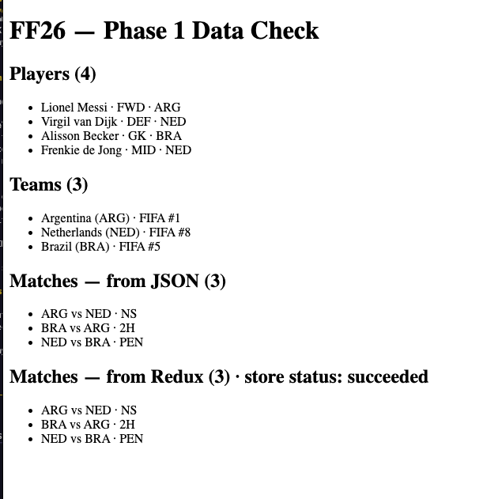

______________________________

# FF22 Project Notes
______________________________

## Phase 0 — Setup & Skeleton - Complete 3/16/26

// ====== Goal: Get a working dev environment and repo structure. =====

1. Initialize project:
   - Vite + React + TypeScript

2. Create Github Repository and link

3. Create folder structure:

src/
  components/                 # Reusable UI components

    PlayerCard/
        index.ts                 # Barrel export
        PlayerCard.tsx           # Component logic & JSX
        PlayerCard.module.scss   # Component styles

    TeamCard/
        index.ts
        TeamCard.tsx
        TeamCard.module.scss

    MatchCard/
        index.ts
        MatchCard.tsx
        MatchCard.module.scss
        MatchTimeline.tsx        # Subcomponent for event timeline
        PlayerBreakdown.tsx      # Subcomponent for per-player fantasy points

    LineupSelection/
        index.ts
        LineupSelection.tsx
        LineupList.tsx           # List of selectable players by position
        DragDropBoard.tsx        # Drag & drop board for team selection

    InsightsPanel/
        index.ts
        InsightsPanel.tsx
        AIInsights.tsx           # AI-generated insights subcomponent

    Layout/
        index.ts
        Layout.tsx               # Main layout wrapper (dashboard, page shells)
    pages/              # Full pages/screens
        Dashboard/
        Lineup/
        Insights/
        ...
  
  data/               # Mock JSON, cached historical stats
    players.json
    teams.json
    matches.json
    historicalCache.ts  # optional TS helper for cached stats
  
  types/              # TypeScript interfaces
    player.ts
    team.ts
    match.ts
    fantasyScore.ts
  
  services/           # API calls and external integration
    apiFootball.ts    # REST API integration & normalization
    aiService.ts      # Claude/OpenAI helper
    webSocket.ts      # Live match feed connection
    authService.ts    # Optional Firebase / Supabase auth
    ...

  lib/                # Pure helper functions / algorithms / scoring
    scoring.ts        # Fantasy points calculations
    aiHelpers.ts      # Prompt building, parsing AI outputs
    utils.ts          # Generic helpers
  
  store/              # Redux store
    index.ts
    slices/
      lineupSlice.ts
      matchSlice.ts
      aiSlice.ts
      ...
  
  styles/             # SCSS files / global styles
    _variables.scss
    _mixins.scss
    main.scss
  
  assets/             # Images, fonts, icons
    logos/
    flags/
    playerPortraits/
    ...
  
  hooks/              # Custom React hooks
    useMatchFeed.ts
    useAIInsights.ts
    ...

4. Install essential dependencies:
   - Axios / Fetch for REST
   - redux + @reduxjs/toolkit for state management
   - react-dnd for drag & drop team selection
   - sass (SCSS support for styling)

--- 

## Phase 1 — Mock Data & Core Types complete 3/17/2025

// ====== Goal: Define the shape of data before connecting APIs. =====

1. Finalize and define rules for selection and scoring

2. Create mock JSON:
   - players.json
   - teams.json
   - matches.json

3. Define TypeScript interfaces:
   - Player, Team, Match, FantasyScore

4. Ensure Redux store is initialized to hold:
   - Selected teams & players
   - AI insights
   - Match updates (for WebSocket feed later)

5. Test importing mock data and rendering simple lists in a dashboard component.
   - Complete 3/17/26 

// ===== Process Key: Use mock data first, swap in REST, then add AI / GraphQL / WebSocket. =====

---

## Phase 2 — Basic UI Components

// ====== Goal: Render interactive UI using mock data + establish component structure for live + fantasy features. =====

1. PlayerCard component:
   - Name
   - Position (normalized)
   - National team (jersey colors/icon + Country abreviation ie: NED for Nederlands)
   - Professional team (display name only)
   - Status (starting / not expected to start)
   - Recent performance stats (last 10 matches):
     - Minutes played
     - Goals
     - Assists
     - Penalties
   - Entry point for AI insights (tooltip or expandable)

2. TeamCard component:
   - Team name
   - Flag + jersey colors/icon
   - FIFA ranking (if available)
   - Historical performance (last 5 World Cup appearances):
     - Matches played
     - Goals for / against
     - Penalties
   - Entry point for AI insights (team-level trends)

3. MatchCard component:
   - Dynamic, real-time match component that:
     - Displays match state (upcoming / live / finished)
     - Shows live score and match minute
     - Tracks fantasy scoring impact (team + player contributions)
     - Highlights selected teams/players
     - Core subcomponents:
       - MatchHeader
         - Teams, flags, score, status
       - MatchStatusBar
         - Current minute, live indicator
       - FantasyImpact
         - Points gained/lost by user selections
       - ExpandToggle
         - Button or control to expand/collapse details
     - Expanded view (when `expanded = true`):
       - MatchTimeline
         - Goals, penalties, substitutions
       - PlayerBreakdown
         - Per-player fantasy points
       - AIInsights
         - Optional per-match or per-player insights

## Phase 2.5 — Architecture & Implementation Plan for Dashboard/Roster/FutureMatches

// ====== Goal: Plan full page structure, routing, state management, and data models before implementation. =====

### Key Design Decisions:

**Navigation Structure:**
- Three main pages:
  1. Dashboard (landing page) - overview of current/upcoming/past matches
  2. Roster (formerly "Lineup") - player/squad selection and management
  3. Future Matches - tournament brackets + insights and team strategy recommendations

**Dashboard Page Features:**
- Summary stats ticker (marquee style):
  - Tournament-to-date match scores
  - Coming matches with dates/times/locations
  - "Find Match Day Tickets" (StubHub link)
  - "Find Merch" (FIFA Store link)
- Match list (minimal view):
  - All upcoming, current, and last week's final scores
  - Non-roster matches show team/time/score only
  - Roster matches highlighted to indicate fantasy impact
  - Click roster match to open MatchCard modal
- Roster sidebar (collapsible on browser/tablet):
  - Shows current roster at-a-glance
  - "GO TO ROSTER" link/button to navigate to Roster page

**Roster Page Features:**
- Position filter (dropdowns, not checkboxes - tab-through friendly)
- Select position → show available players for that position
- Drag players between available/unsigned/signed/starters/bench
- Squads always displayed at top (max 4 signed)
- Validation rules (through Round 16):
  - Must have 11+ players signed to unlock starters/bench drag
  - Must have 4 squads signed
  - One dedicated goalie slot required
- Post-Round 16:
  - Roster locks to no new additions
  - Can still replace eliminated players
  - Players continue to be eliminated as tournament progresses
- Semantic HTML, aria labels, tab-through friendly

**Future Matches Page Features:**
- Tournament bracket view (groups → knockout stages)
- Mobile: dropdown/tab-through to select matches
- Desktop: full bracket display
- Click match for insights/recommendations panel
- Insights priority levels:
  - ⚠️ High Priority: team conflicts, strategic warnings
  - ℹ️ Info: lineup optimization, player recommendations
- "Click for insights" to trigger updates

---

### File Structure (Current):

```
src/
  pages/
    Dashboard.tsx           # Match summary, roster impact overview
    Roster.tsx              # Available players + squads, bench/starters
    FutureMatches.tsx       # Tournament bracket view & insights

  components/
    Navigation/
      TopNav.tsx
      Sidebar.tsx
      BottomNav.tsx
      ThemeToggle.tsx

    Dashboard/
      MatchList.tsx
      SummaryTicker.tsx
      RosterSidebar.tsx

    Roster/
      PositionFilter.tsx           # Dropdown: ALL, GK, DEF, MID, FWD
      AvailablePlayersList.tsx     # Grid cards (3-row fixed height, scrollable)
      AvailableSquadsList.tsx      # Squad selection cards
      RosterDragZone.tsx           # Unsigned players (GK/DEF/MID/FWD columns)
      RosterSidebar.tsx            # Goalie cap + validation display
      SquadsSection.tsx            # Squad status
      SquadSigningModal.tsx        # Squad confirmation modal
      AvailableSquadsList.tsx      # Available squad grid

    FutureMatches/
      BracketView.tsx
      BracketDropdown.tsx
      InsightsPanel.tsx

    Modals/
      Modal.tsx                    # Base modal wrapper
      MatchCardModal.tsx
      PlayerCardModal.tsx          # Status: available | starter | bench | eliminated
      SquadCardModal.tsx
      PlayerSigningModal.tsx       # Confirmation: "Player X of 18. Min. 1 of 3 goalies?"
      SquadSigningModal.tsx

    PlayerCard/
      PlayerCard.tsx               # Detailed stats + fantasy status badge

    SquadCard/
      SquadCard.tsx

    MatchCard/
      MatchCard.tsx
      MatchCard.module.scss

    Dashboard/
      MatchList.tsx
      MatchList.module.scss
      SummaryTicker.tsx
      SummaryTicker.module.scss
      RosterSidebar.tsx

    Shared/
      RosterSidebar.tsx

  store/
    index.ts
    slices/
      rosterSlice.ts               # Players: available, unsigned, signed, starters, bench, eliminated
      matchesSlice.ts              # Match data + live scores
      uiSlice.ts                   # Modal state, sidebar visibility
    middleware/
      eliminationMiddleware.ts      # Team elimination cascade logic

  services/
    matchService.ts                # getMatches(), normalizeData()
    pollService.ts                 # startPolling(), managePollingIntervals()
    rosterService.ts               # validateRoster(), canAddToStarters(), etc.
    SERVICES_ARCHITECTURE.md       # Detailed separation of concerns

  data/
    squads.json                    # 4 teams w/ officialRoster (id, name, position, number, flag, matchPoints)
    matches.json                   # Fixtures + live scores
    historicalCache.ts             # In-memory cache structure

  lib/
    nationalColors.ts              # nationalColors, nationalFlags, nationalConfederations, nationalMerchUrls
    scoring/
      calculateSquadScore.ts       # Match impact calculations
    dataTransform.ts               # enrichPlayerForDisplay(), transformMatch(), etc.

  layouts/
    AppLayout.tsx
    AppLayout.module.scss

  hooks/
    useTheme.ts                    # Light/dark/system theme management

  styles/
    tokens.scss                    # Sass design tokens (spacing, colors, fonts, shadows)
    THEME_GUIDE.md                 # Theme system documentation

  types/
    match.ts                       # RosterPlayer, RosterSquad, Match
    squad.ts                       # Squad types with pool states
    player.ts                      # Player types with elimination tracking
```

**Key Consolidations:**
- ✅ players.json + teams.json → squads.json officialRoster
- ✅ Layout/ → Navigation/
- ✅ Store uses slices/ subfolder + middleware for side effects
- ✅ Theme system: Sass design tokens + useTheme hook
- ✅ Modal confirmations: PlayerSigningModal, SquadSigningModal
- ✅ Available players: 3-row fixed height grid, scrollable
- ✅ Elimination logic: Redux middleware with three-path cascade (signed→eliminatedSigned, unsigned→available, available→stays)
- ✅ Responsive design: Tab-based mobile/tablet layout with 768px/767px breakpoints
- ✅ SCSS modules: Component-scoped styling with Sass tokens

---

4. Layout / Pages:
   - Dashboard page:
     - Overview of matches, scores, and fantasy impact
   - Lineup page:
     - Team selection (drag & drop)
     - Player selection (by position, checkbox list)
   - Insights panel:
     - Placeholder structure for:
       - Global strategy insights
       - Team selection guidance (ie: red flag when selecting two teams required to eliminate each other to proceed)
       - Player selection recommendations

5. Redux state integration for UI interactivity:
   - dragging teams
   - selecting players
   - placeholder insights

// ===== All components should support: =====
- Loading state (skeleton or spinner)
- Empty state (no data available)
- Error state (API failure fallback)

// ===== Checkpoint: all mock data should be renderable in the dashboard. ===== //

---------------------------------------------------------
### COMPLETE TO THIS POINT (3/27/26) - REFACTOR FOR TURN BASED PLAY
_________________________________________________________


## Phase 3 — API Integration & Refactor to Turn-Based Gameplay

// ====== Goal: Load initial roster data from API and shift from live-action to turn-based gameplay. =====

**Context:** After API exploration, discovered that real-time match data (live scores, minute-by-minute events) is behind an undisclosed paywall. Pivoting to historical 2022 World Cup data for initial roster load and turn-based game mechanics.

### 3.1 — Remove Live-Action Logic (COMPLETED)

**Removed:**
- ✅ `gamesComplete` property from all types and state
- ✅ Live polling infrastructure
- ✅ `updateGameComplete` reducer
- ✅ All game completion selectors
- ✅ AI slice (Claude/OpenAI integration)

**Remaining cleanup:**
-  match prediction logic
- Polling service references (matchService.ts, pollService.ts)

### 3.2 — Load Initial 2022 Roster Data

**Initial Load (Turn 1):**
- All 32 teams and ~650 players load from `squads.json` in `available` pool
- No API call needed for initial state — data already normalized in JSON
- Data structure includes:
  - 32 teams (names, flags, codes, coaches)
  - Players per team (name, position, number, stats, injury status)
  - 2022 historical baseline stats for scoring reference

**Turn-Based Match Data Loading:**
- Each turn's match results fetched via single API call when user clicks "Play"
- API call retrieves for that round:
  - Scoring data (goals, assists, clean sheets)
  - Red card and yellow card information
  - Substitution details for squad/player tracking
  - Any elimination status updates

### 3.3 — Implement Turn Completion Async Thunk

**Single "Play" Button Flow:**
1. User confirms roster/starters setup
2. Clicks "Play" to advance to next round
3. Single API call fetches match results for that turn
4. **Async thunk** sequence executes in strict order:
   - **Step 1:** Update all scores and create/update Scoring Record (first thing to display)
   - **Step 2:** Lock scores for all squads and players (points are final for this turn)
   - **Step 3:** Update eliminated status (cascade from National Team eliminations + individual incidents)
   - **Step 4:** Show elimination notification modal (squads and players eliminated this turn)
   - **Step 5:** Move all eliminated members to "eliminated" pool with "eliminatedSigned" role

**Implementation:**
- File: `/src/store/thunks/rosterThunks.ts` (new)
- Use `redux-thunk` async thunk pattern (async/await with dispatch in sequence)
- All updates dispatch through Redux middleware (enables time-travel debugging)
- See `roster-logic-rebuild.md` Section 11 for detailed async thunk implementation

**Scoring Record Component (NEW):**
- Replaces current MatchInsights component
- Displays: "Squads points + Players points = Total points"
- **Cumulative:** Points accumulate across all turns
- **Critical:** Eliminated members retain their points from the turn they were eliminated
- Updated first on "Play" (Step 1), then static until next "Play"
- Optional rolling count-up animation for combined total in header
- Location: `/src/components/Roster/ScoringRecord.tsx` or `/src/components/Dashboard/ScoringRecord.tsx`

**Roster Flexibility Between Turns:**
- After eliminations applied and announced, user can:
  - Sign non-eliminated, unsigned players/squads to replace eliminated signed members
  - Adjust starters/bench assignments
  - Take unlimited time (no timer/lock until next "Play" click)
- Finished matches from prior round remain visible (reference for decisions)

### 3.4 — Turn Structure & Match Display

**Tournament Rounds as Turns:** Includes prior dates as part of pull
1. Group Stage 1 (Nov 20-26, 2022)
2. Group Stage 2 (Nov 27-Dec 3, 2022) overlap with Round of 16 game 1 - pull with care
3. Round of 16 (Dec 3-7, 2022) overlap with Group Stage 2 by 1 game - pull with care
4. Quarterfinals (Dec 9-11, 2022)
5. Semifinal (Dec 14-15, 2022)
6. Third Place & Final (Dec 16-17, 2022)

**Dashboard Match Display:**
- **Finished:** Matches from completed prior turns
- **Live:** Current turn's matches - display with halftime score as "live"
- **Upcoming:** Next turn's matches (displayed by position only, e.g., "1A v 2B", not team names)
- **Group affiliation displayed** for all Group Stage matches

### 3.5 — Round-Specific Roster Availability Logic

**Group Stage 1 (Turn 1):**
- All squads and players available for selection

**Group Stage 2, R16, Quarterfinals:**
- Only non-eliminated, unsigned squads and players available at full points
- Pools checked: `available` and `unsigned` (standard logic, no changes)

**Quarterfinals & Beyond:**
- Final replacements available as **Substitute only** (50% points multiplier for entire tournament)
- Substitute flag applies ONLY to new signings made during Quarterfinals window
- Does NOT apply to existing roster members

### 3.6 — Scoring System Rebalance

**Key Changes:**
- Scoring rebalanced to work with publicly available 2022 World Cup results
- **CRITICAL:** Scoring formula must be rebalanced for pre-known match results
  - With historical data, all outcomes are known at game start (no uncertainty)
  - Traditional fantasy scoring (variable points per event) can be exploited with perfect information
  - Need to define balanced point values that account for result certainty
  - Example: Goals in a tournament-ending match have lower variance than early-round goals
  - Consult: `lib/scoring/calculateSquadScore.ts` — define and document scoring rules
- Eliminated members' points from their final turn remain part of cumulative total
- Squad points + Player points compound turn-by-turn
- Details automatically accumulate into squad and player cards as tournament progresses
- Substitute multiplier (50%) applies consistently across all remaining turns for R16+ signings

**Scoring Tracking:**
- `matchPoints` — Points by individual match/game (calculated per turn via API)
- `totalPoints` — Cumulative across all turns (respects substitute multiplier if applicable)
- Eliminated players/squads display final scores on their cards

**Scoring Formula (Phase 3.6):**
- Define point values for: goals, assists, clean sheets, red/yellow cards, substitutions
- Account for tournament stage weighting (is a QF goal worth same as Group Stage goal?)
- Document in `/src/lib/scoring/calculateSquadScore.ts`
- Test against 2022 historical data to ensure balance

### 3.7 — Component Updates Required

**1. Scoring Record Component (NEW)** 
- **File:** `/src/components/Dashboard/ScoringRecord.tsx` (new)
- **Replaces:** MatchInsights component (remove from codebase)
- **Display:** Shows cumulative turn-by-turn breakdown
  - Format: "Squads: X pts | Players: Y pts | Total: Z pts"
  - Shows running tally of all completed turns
- **Update timing:** Updated on "Play" click (Step 1 of async thunk) — displayed before eliminations
- **Behavior:** Static until next "Play" click
- **Visual:** Optional rolling count-up animation for combined total in header
- **Data source:** Redux state `scoring.turns` (cumulative across all turns)

**2. Dashboard Page Updates** 
- **File:** `/src/pages/Dashboard.tsx` (modify)
- **Match display by status:**
  - **Finished:** All matches from completed prior turns (shown for reference)
  - **Live:** Current turn's matches (in progress or scheduled)
  - **Upcoming:** Next turn's matches (position-based display only, e.g., "1A v 2B" not team names)
- **Group affiliation:** Displayed for all Group Stage 1 & 2 matches
- **Header updates:** Add running total (optional animated counter after "Play" click)
- **Roster sidebar:** Quick reference to current roster status (signed squads/players count)

**3. Roster & Player/Squad Cards** 🃏
- **Files:** `/src/components/PlayerCard/PlayerCard.tsx`, `/src/components/SquadCard/SquadCard.tsx` (modify)
- **Display cumulative points:** Show `totalPoints` (includes substitute multiplier if applicable)
- **Show eliminated status:**
  - Visual indicator (greyed out, "Eliminated" badge)
  - Display final points earned in tournament (locked, non-editable)
  - Show elimination reason (if tracked: injury, red card, team elimination)
- **"See Insights" button:** Deferred to Phase 5 (just keep placeholder for now)

**4. Modals** 📋
- **File:** `/src/components/Modals/EliminationModal.tsx` (new) or `/src/components/Modals/Modal.tsx` (extend)
- **Elimination Notification Modal:**
  - Triggered after Step 4 of async thunk
  - Displays squads eliminated this turn
  - Displays players eliminated this turn
  - Shows reason (team eliminated vs individual incident)
  - User must acknowledge before roster edits allowed
- **Roster Confirmation Modal** (optional):
  - Before "Play" click, confirm roster is locked for this turn
  - Show count: "Playing with X squads, Y starters, Z bench"
  - [Cancel] or [Confirm Play]

### 3.8 — Phase 3 Systematic Implementation Tasks

**Documentation Updates:**
- [ ] Delete `docs/2022revision-notes.md` (all content extracted to roster-logic-rebuild.md & project-notes.md)
- [ ] Verify `src/services/SERVICES_ARCHITECTURE.md` reflects turn-based model
- [ ] Verify `docs/roster-logic-rebuild.md` Section 11 (async thunk) is complete

**State Management (Redux):**
- [ ] Implement `playTurn()` async thunk in `/src/store/thunks/rosterThunks.ts` (new file)
  - Fetch match results (Step 0)
  - Update scores (Step 1)
  - Lock turn scores (Step 2)
  - Update elimination status (Step 3)
  - Show modal (Step 4)
  - Move eliminated to pool (Step 5)
- [ ] Add `isRosterLocked` boolean to `rosterSlice.ts` state (initialize: false, set true on QF "Play")
- [ ] Update `rosterSlice.ts` reducers to enforce lock (disable pool changes when locked)
- [ ] Add `selectIsRosterLocked` selector to `scoringSelectors.ts`
- [ ] Update `canAddSquadToUnsigned()` validation to check `!isRosterLocked`
- [ ] Update `canAddPlayerToRoster()` validation to check `!isRosterLocked`

**Component Updates (Roster Lock Behavior):**
- [ ] Update `StartersLineup.tsx`: Show 11 fixed slots (before QF), dynamic slots (after QF lock)
- [ ] Update `RosterPlayersBench.tsx`: Disable add/remove buttons when `isRosterLocked === true`, keep move enabled
- [ ] Update `AvailablePlayersList.tsx`: Disable "Add to Roster" button when locked
- [ ] Update `AvailableSquadsList.tsx`: Disable "Add to Roster" button when locked
- [ ] Update all relevant components to use `selectIsRosterLocked` selector

**New Components:**
- [ ] Implement `ScoringRecord.tsx` (displays cumulative squad + player + total points per turn)
- [ ] Implement `EliminationModal.tsx` (shows squads/players eliminated with reasons)
- [ ] Wire modals into async thunk flow (modal appears after Step 3, user must acknowledge before Step 5)

**Dashboard Updates:**
- [ ] Update `Dashboard.tsx` match display logic:
  - Finished matches (prior rounds)
  - Live matches (current turn)
  - Upcoming matches (next turn, position-based display)
  - Group affiliation for Group Stage
- [ ] Add running total header counter (optional animation)
- [ ] Add roster sidebar quick reference

**Card Component Updates:**
- [ ] Update `PlayerCard.tsx` to display `totalPoints` and eliminated status
- [ ] Update `SquadCard.tsx` to display `totalPoints` and eliminated status
- [ ] Add visual indicators (greyed out when eliminated, badges for status)

**Service/API Integration (see `docs/SERVICES_ARCHITECTURE.md` Phase 3 checklist):**
- [ ] Update `matchService.ts`:
  - [ ] Implement `getMatchResults(turnId)` for API-Football v3 integration
  - [ ] Implement `normalizeMatchResults()` to convert API response to internal type
  - [ ] Implement `calculatePlayerScore()` per scoring formula
  - [ ] Implement `calculateSquadScore()` per scoring formula
  - [ ] Add error handling for API failures (network, rate limits, invalid turn)
  - [ ] Add optional caching layer (cache results per turn)
- [ ] Revize environment variables (`.env` for Vite):
  - [ ] `VITE_API_FOOTBALL_KEY`
  - [ ] `VITE_API_FOOTBALL_BASE_URL`
  - [ ] `VITE_API_FOOTBALL_HOST`
- [ ] Define scoring formula in `/src/lib/scoring/calculateSquadScore.ts`based on available data in pull:
  - [ ] Confirm Point values for goals, assists, clean sheets
  - [ ] Red/yellow card impact
  - [ ] Tournament stage weighting (as applicable)
  - [ ] Document assumptions and rationale
- [ ] Test matchService integration:
  - [ ] Test against 2022 World Cup historical data
  - [ ] Verify score calculations match formula
  - [ ] Test error scenarios (missing data, API unavailable)
  - [ ] Test performance with all 32 teams + ~650 players

**Testing & Verification:**
- [ ] Test async thunk sequence: "Play" click → API call → sequential state updates
- [ ] Test scoring calculations against 2022 World Cup historical data
- [ ] Test roster lock enforcement (add/remove disabled after QF Play, move to starter/bench still works)
- [ ] Test formation grid transitions (11 fixed slots → dynamic)
- [ ] Test elimination modal display and user acknowledgment flow
- [ ] Test all components reflect lock state via selectors
- [ ] Verify no data races or race conditions in async thunk

---

### Key Gameplay Changes from Live-Action to Turn-Based:
- **No polling:** Match results fetch on-demand via single API call per turn
- **No gamesComplete check:** All players eligible for roster swaps between turns
- **Cumulative scoring:** Points carry forward across all turns
- **Flexible roster updates:** Users control timing between turns (no time limits)
- **Round-based progression:** Matches group into 6 sequential turns (Group Stage 1 → Final)
- **Historical data:** All results based on 2022 World Cup publicly available records

---

// ===== Problems for Future Me =====//

---

## Phase 4 — Auth / Database Integration

// ====== Goal: Allow users to save their fantasy teams. =====

1. Decide MVP approach:
   - Firebase Auth (fast, serverless) or
   - SQL (PostgreSQL / Supabase) for custom auth

2. Connect database:
   - Save user-selected lineups
   - Store historical performance / match updates

3. Secure API routes for CRUD operations:
   - Save team
   - Fetch team
   - Update / delete lineup

---

## Phase 5 — Final UI Polish

// ====== Goal: Clean and shiny. =====

1. Styling

2. Responsive design for dashboard + lineup panel

3. Error handling + empty states + loaders

4. Wireframe alignment check (ensure your initial plan matches implementation)

---

## Phase 6 — Documentation / README / Notes

// ====== Goal: Make your project self-explanatory. =====

1. Update README.md with:
   - Final Tech stack
   - Screenshots
   - How To Use/Recreate (KEEP IT SIMPLE - direct to design notes)

2. Make sure docs/design-notes.md is updated:
   - Architecture diagrams
   - Mock data notes
   - TODO notes for next phases